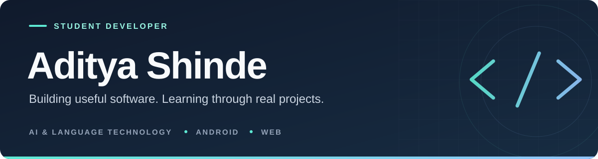

  

### BCA Student · Aspiring Software Developer

**AI & Language Technology · Android · Web Development**

[LinkedIn](https://in.linkedin.com/in/aditya-shinde1537) &nbsp;·&nbsp; [Projects](#featured-projects) &nbsp;·&nbsp; [All repositories](https://github.com/adityashinde1537?tab=repositories)

---

## About me

I'm **Aditya Shinde**, a Bachelor of Computer Applications student at **D. Y. Patil Agriculture & Technical University, Talsande**, in Maharashtra, India. I enjoy turning everyday problems into practical software, with a growing focus on language accessibility and education.

- **Building:** Android apps, Python APIs, and React interfaces through student projects.
- **Exploring:** Hindi–Santhali translation and tools that support learning in a student's mother tongue.
- **Strengthening:** Java, Python, programming fundamentals, software testing, and application design.

## Featured projects

### [JanSetu — Tribal Language Education](https://github.com/adityashinde1537/SIH26042-Tribal-Language-Education)

**SIH26042 · Smart India Hackathon 2026 · Team JanSetu**

A Hindi → Santhali (Ol Chiki) education prototype for primary classrooms. Combines translation, a synchronized offline vocabulary library, and bilingual worksheets and flashcards.

**Stack:** Kotlin · Jetpack Compose · Python · FastAPI · Room/SQLite · IndicTrans2

**Stage:** Prototype. Downloaded translations work offline; unseen text needs the backend. Classroom use still needs native-speaker validation.

### [IP-SAKTI Sahayak](https://github.com/adityashinde1537/ip-sakti-sahayak)

**SIH26045 · Smart India Hackathon 2026 · Team JanSetu**

A prototype for exploring intellectual-property and regulatory information in Ayurveda. Uses a curated source registry, cited responses, and separate India/international query flows.

**Stack:** React · Vite · Python · FastAPI

**Stage:** Demo prototype. Broader source coverage and multilingual speech integration are planned.

### [Hindi → Santhali TranslationApp](https://github.com/adityashinde1537/TranslationApp)

An Android translation prototype connected to a FastAPI backend, with IndicTrans2 inference, Ol Chiki output checks, SQLite caching, and loading/error states.

**Stack:** Kotlin · Jetpack Compose · Retrofit · Python · FastAPI · ONNX Runtime

**Stage:** Backend-connected prototype; translation quality still needs native-speaker evaluation.

## Technologies I'm working with

| Area | Technologies |
| --- | --- |
| Programming | Java, Python, Kotlin, JavaScript |
| Android | Jetpack Compose, Material 3, Retrofit, Room |
| Web & APIs | React, Vite, FastAPI |
| Data & language tools | SQLite, IndicTrans2, ONNX Runtime |
| Development workflow | Git, GitHub, GitHub Actions, software testing |

## Let's connect

I'm interested in learning with other developers and collaborating on student projects in education, language technology, and practical applications.

**[Connect on LinkedIn →](https://in.linkedin.com/in/aditya-shinde1537)**

---

<i>Learn the fundamentals. Build something useful. Keep improving.</i>

